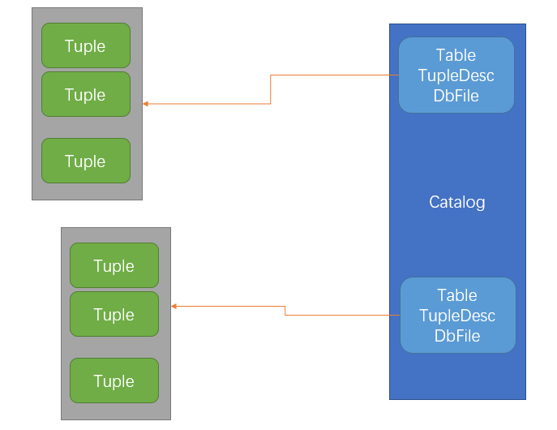

# 6.830 Lab 1: SimpleDB

[course-info-2018](https://link.zhihu.com/?target=https%3A//github.com/MIT-DB-Class/course-info-2018/)

[simple-db-hw](https://link.zhihu.com/?target=https%3A//github.com/MIT-DB-Class/simple-db-hw)

SimpleDB是一个简单的DBMS。

**测试驱动，没有思路，或有什么疑惑，看测试用例！**

**面向接口编程！**

我们应该更侧重于接口，设定接口，设置输入输出，当对该接口的实现经过测试基本正确工作后，我们不应该总是纠结、回想接口的具体实现，而是应该、甚至可以把已经正确工作的实现抛在脑后，然后只看接口来进行编程。我们的变量也应该更多地声明为接口类型，而不是实现接口的具体类型。

**Here's a rough outline of one way you might proceed with your SimpleDB implementation:**

------

- Implement the classes to manage tuples, namely Tuple, TupleDesc. We have already implemented Field, IntField, StringField, and Type for you. Since you only need to support integer and (fixed length) string fields and fixed length tuples, these are straightforward.
- Implement the Catalog (this should be very simple).
- Implement the BufferPool constructor and the getPage() method.
- Implement the access methods, HeapPage and HeapFile and associated ID classes. A good portion of these files has already been written for you.
- Implement the operator SeqScan.
- At this point, you should be able to pass the ScanTest system test, which is the goal for this lab.

## 2. SimpleDB Architecture and Implementation Guide

SimpleDB consists of:

- Classes that represent fields, tuples, and tuple schemas;
- Classes that apply predicates and conditions to tuples;
- One or more access methods (e.g., heap files) that store relations on disk and provide a way to iterate through tuples of those relations;
- A collection of operator classes (e.g., select, join, insert, delete, etc.) that process tuples;
- A buffer pool that caches active tuples and pages in memory and handles concurrency control and transactions (neither of which you need to worry about for this lab); and,
- A catalog that stores information about available tables and their schemas.

SimpleDB does not include many things that you may think of as being a part of a "database." In particular, SimpleDB does not have:

- (In this lab), a SQL front end or parser that allows you to type queries directly into SimpleDB. Instead, queries are built up by chaining a set of operators together into a hand-built query plan (see [Section 2.7](https://github.com/MIT-DB-Class/course-info-2018/blob/master/lab1.md#query_walkthrough)). We will provide a simple parser for use in later labs.
- Views.
- Data types except integers and fixed length strings.
- (In this lab) Query optimizer.
- (In this lab) Indices.

### 2.1. The Database Class

The Database class provides access to a collection of static objects that are the global state of the database. In particular, this includes methods to access the catalog (the list of all the tables in the database), the buffer pool (the collection of database file pages that are currently resident in memory), and the log file.

### 2.2. Fields and Tuples

每一个Tuple是Field对象的集合，TupleDesc是field type+field name，TupleDesc是具体的Tuple的抽象描述(schema（模式、概要）)。

**Exercise 1.**

- src/simpledb/TupleDesc.java

  ```java
  public class TupleDesc implements Serializable {
  	private ArrayList<TDItem> tdItems;
      
          public static class TDItem implements Serializable {
      	    private static final long serialVersionUID = 1L;
  	
      	    /**
      	     * The type of the field
      	     * */
      	    public final Type fieldType;
      	    
      	    /**
      	     * The name of the field
      	     * */
      	    public final String fieldName;
  	
      	    public TDItem(Type t, String n) {
      	        this.fieldName = n;
      	        this.fieldType = t;
      	    }
  	
      	    public String toString() {
      	        return fieldName + "(" + fieldType + ")";
      	    }
      	}
      public TupleDesc(Type[] typeAr, String[] fieldAr) {}
      public TupleDesc(Type[] typeAr) {}
      public int numFields() {}
      public String getFieldName(int i) throws NoSuchElementException {}
      public Type getFieldType(int i) throws NoSuchElementException {}
      public int fieldNameToIndex(String name) throws NoSuchElementException {}
      /**
       * @return The size (in bytes) of tuples corresponding to this TupleDesc.
       *         Note that tuples from a given TupleDesc are of a fixed size.
       */
      public int getSize() {}
      public static TupleDesc merge(TupleDesc td1, TupleDesc td2) {}
      public boolean equals(Object o) {}
  ```

  通过测试TupleDescTest。

- src/simpledb/Tuple.java

  ```java
  public class Tuple implements Serializable {
  	private TupleDesc tDesc;
  	private ArrayList<Field> fields;
  	private RecordId rid;
      
  	// getters and setters ...
  }
  ```

  通过测试TupleTest。

### 2.3. Catalog

The catalog (class `Catalog` in SimpleDB) consists of a list of the tables and schemas of the tables that are currently in the database. You will need to support the ability to add a new table, as well as getting information about a particular table. Associated with each table is a `TupleDesc` object that allows operators to determine the types and number of fields in a table.（注意一个表只有一个TupleDesc对象实体，只不过一个表中的每个Tuple都有指针指向它）

The global catalog is a single instance of `Catalog` that is allocated for the entire SimpleDB process. The global catalog can be retrieved via the method `Database.getCatalog()`, and the same goes for the global buffer pool (using `Database.getBufferPool()`).

**Exercise 2.**

- src/simpledb/Catalog.java

  ```java
  public class Catalog {
  	private HashMap<Integer, Table> tables;
  	private HashMap<String, Integer> name2Id;
  	
  	private class Table {
  		public String tableName; // 不应该是final的，因为这些按理说可以修改。
  		public DbFile dbFile; // 一个Table与一个DbFile关联。
  		public String pkeyField;
  		
  		public Table(DbFile dbFile, String tableName, String pkeyField) {
  			this.dbFile = dbFile;
  			this.tableName = tableName;
  			this.pkeyField = pkeyField;
  		}
  	};
      /**
       * Add a new table to the catalog.
       * This table's contents are stored in the specified DbFile.
       * @param file the contents of the table to add;  file.getId() is the identfier of
       *    this file/tupledesc param for the calls getTupleDesc and getFile
       * @param name the name of the table -- may be an empty string.  May not be null.  If a name
       * conflict exists, use the last table to be added as the table for a given name.
       * @param pkeyField the name of the primary key field
       */
      public void addTable(DbFile file, String name, String pkeyField) {
          // some code goes here
      	// this.tables.put(file.getId(), new Table(file, name, pkeyField));
      	if (name2Id.containsKey(name)) {
      		name2Id.replace(name, file.getId());
      		if (tables.containsKey(file.getId())) {
      			tables.replace(file.getId(), new Table(file, name, pkeyField));
      		} else {
      			tables.put(file.getId(), new Table(file, name, pkeyField));
      		}
      	} else {
      		name2Id.put(name, file.getId());
      		tables.put(file.getId(), new Table(file, name, pkeyField));
      	}
      }
      public int getTableId(String name) throws NoSuchElementException {}
      public TupleDesc getTupleDesc(int tableid) throws NoSuchElementException {}
      public DbFile getDatabaseFile(int tableid) throws NoSuchElementException {}
      public String getPrimaryKey(int tableid) {}
      public Iterator<Integer> tableIdIterator() {}
      public String getTableName(int id) {}
      public void clear() {}
  	/**
       * Reads the schema from a file and creates the appropriate tables in the database.
       * @param catalogFile
       */
      public void loadSchema(String catalogFile) {}
  ```

  通过测试CatalogTest。

### 2.4. BufferPool

The buffer pool (class `BufferPool` in SimpleDB) is responsible for caching pages in memory that have been recently read from disk. **All operators read and write pages from various files on disk through the buffer pool**. It consists of a fixed number of pages, defined by the `numPages` parameter to the `BufferPool` constructor. In later labs, you will implement an eviction policy.

**Exercise 3.**

- src/simpledb/BufferPool.java

  ```java
  public class BufferPool {
  	private int numPages;
  	private HashMap<PageId, Page> pages;
      /**
       * Retrieve the specified page with the associated permissions.
       * Will acquire a lock and may block if that lock is held by another
       * transaction.
       * <p>
       * The retrieved page should be looked up in the buffer pool.  If it
       * is present, it should be returned.  If it is not present, it should
       * be added to the buffer pool and returned.  If there is insufficient
       * space in the buffer pool, a page should be evicted and the new page
       * should be added in its place.
       *
       * @param tid the ID of the transaction requesting the page
       * @param pid the ID of the requested page
       * @param perm the requested permissions on the page
       */
      public Page getPage(TransactionId tid, PageId pid, Permissions perm)
          throws TransactionAbortedException, DbException {
          // some code goes here
      	if (pages.size() > numPages)
      		throw new DbException(null);
      	if (pages.containsKey(pid)) { // cache hit.
      		return pages.get(pid);
      	} else { // cache miss.
      		DbFile dbFile = Database.getCatalog().getDatabaseFile(pid.getTableId());
      		Page page = dbFile.readPage(pid);
      		pages.put(pid, page);
      		return page;
      	}
      }
  }
  ```

### 2.5. HeapFile access method



BufferPool在内存中缓存Page，HeapFile是HeapPage的集合，HeapPage是tuple的集合，HeapPage首先有一个header，这是一个bitmap，故每一个tuple在HeapPage中占用的bit数为`tuple size * 8 + 1`。从磁盘中读写Page是由DbFile的readPage()负责的，其它对象读写Page都是通过BufferPool的getPage()来获取，getPage()如果缓存miss，则委托DbFile的readPage()从磁盘读入Page。

`_tuples per page_ = floor((_page size_ * 8) / (_tuple size_ * 8 + 1))`

The floor operation rounds down to the nearest integer number of tuples (we don't want to store partial tuples on a page!)

`headerBytes = ceiling(tupsPerPage/8)`

The ceiling operation rounds up to the nearest integer number of bytes (we never store less than a full byte of header information.)

Also, note that the high-order bits of the last byte may not correspond to a slot that is actually in the file, since the number of slots may not be a multiple of 8. Also note that all Java virtual machines are big-endian.（即内存地址递增的方向，大端序会先存放最高有效字节，小端序会先存放最低有效字节）

**Exercise 4.**

- src/simpledb/HeapPageId.java

  ```java
  public class HeapPageId implements PageId {
  	int tableId;
  	int pgNo;
  }
  ```

  通过测试HeapPageIdTest。

- src/simpledb/RecordID.java

  ```java
  public class RecordId implements Serializable {
  	private PageId pId;
  	private int tupleNo;
  }
  ```

  通过测试RecordIdTest。

- src/simpledb/HeapPage.java

  ```java
  public class HeapPage implements Page {
  
      final HeapPageId pid;
      final TupleDesc td;
      final byte header[];
      final Tuple tuples[];
      final int numSlots;
      
      public HeapPage(HeapPageId id, byte[] data) throws IOException {
          this.pid = id;
          this.td = Database.getCatalog().getTupleDesc(id.getTableId());
          this.numSlots = getNumTuples();
          DataInputStream dis = new DataInputStream(new ByteArrayInputStream(data));
  
          // allocate and read the header slots of this page
          header = new byte[getHeaderSize()];
          for (int i=0; i<header.length; i++)
              header[i] = dis.readByte();
          
          tuples = new Tuple[numSlots];
          try{
              // allocate and read the actual records of this page
              for (int i=0; i<tuples.length; i++)
                  tuples[i] = readNextTuple(dis,i); // tuples[i]可能指向null，如果slotId为i的Tuple在该Page中不存在的话。
          }catch(NoSuchElementException e){
              e.printStackTrace();
          }
          dis.close();
  
          setBeforeImage();
      }
      
      private int getNumTuples() {
          // some code goes here
      	return (int) Math.floor(BufferPool.getPageSize()*8/(td.getSize()*8+1));
      }
      
      private int getHeaderSize() {        
          // some code goes here
          return (int) Math.ceil(numSlots/8.0); // XXX 注意这里要做浮点数除法，而不是整数除法，如果写成了整数除法，那么除非刚好整除，否则就会数组下标访问越界。
      }
      
      public boolean isSlotUsed(int i) {
          // some code goes here
          return (header[i/8]&(1<<(i%8)))!=0;
      }
      
      public Iterator<Tuple> iterator() {
          // some code goes here
          return new Iterator<Tuple>() {
          	int i = 0;
          	
  			@Override
  			public Tuple next() {
  				Tuple tuple = tuples[i];
  				i++;
  				return tuple;
  			}
  			
  			@Override
  			public boolean hasNext() {
  				while (i<numSlots && !isSlotUsed(i)) // 注意要判断一下i，避免越界。
  					i++;
  				return i<numSlots;
  			}
  		};
      }
  }
  ```

  通过测试HeapPageReadTest。

**Exercise 5.**

- src/simpledb/HeapFile.java

  ```java
  public class HeapFile implements DbFile {
  	private File file;
  	private TupleDesc tDesc;
  	private int numPages;
  	private int tableId;
      
      public Page readPage(PageId pid) {
          // some code goes here
      	byte[] buf = new byte[BufferPool.getPageSize()];
      	try {
  	    	RandomAccessFile iFile = new RandomAccessFile(file, "r");
  	    	iFile.seek(pid.getPageNumber()*BufferPool.getPageSize());
  	    	iFile.read(buf);
  	    	if (tableId == 0)
  	    		tableId = pid.getTableId();
  	    	return new HeapPage((HeapPageId) pid, buf);
  		} catch (IOException e) {
  			e.printStackTrace();
  			return null; // TODO
  		}
      }
      
      public DbFileIterator iterator(TransactionId tid) {
          // some code goes here
          return new DbFileIterator() {
          	boolean opened = false;
          	// boolean closed = false; // 这个closed是多余的，因为一个迭代器要么已开启，要么已关闭。
          	int pgNo = 0;
          	Iterator<Tuple> it = null;
  			
  			@Override
  			public void rewind() throws DbException, TransactionAbortedException {
  				// TODO Auto-generated method stub
  				pgNo = 0;
  				it = null;
  			}
  			
  			@Override
  			public void open() throws DbException, TransactionAbortedException {
  				// TODO Auto-generated method stub
  				opened = true;
  			}
  			
  			@Override
  			public Tuple next() throws DbException, TransactionAbortedException, NoSuchElementException {
  				// TODO Auto-generated method stub
  				// if (!opened || closed)
                  if (!opened)
  					throw new NoSuchElementException();
  				// 这里假定caller每次都会先检查hasNext()再调用next()，所以没有做更多的检查。
  				return it.next();
  			}
  			
  			@Override
  			public boolean hasNext() throws DbException, TransactionAbortedException {
  				// TODO Auto-generated method stub
  				// if (!opened || closed)
                  if (!opened)
  					return false;
  				if (pgNo > numPages)
  					return false;
  				if (it == null)
  					it = ((HeapPage) Database.getBufferPool().getPage(tid, new HeapPageId(tableId, pgNo), null)).iterator();
  				if (!it.hasNext() && pgNo+1<numPages) { // XXX 注意pgNo是从0开始的，而numPages是Page数组大小。
  					pgNo++;
  					it = ((HeapPage) Database.getBufferPool().getPage(tid, new HeapPageId(tableId, pgNo), null)).iterator();
  				}
  				return it.hasNext();
  			}
  			
  			@Override
  			public void close() {
  				// TODO Auto-generated method stub
  				// closed = true;
                  opened = false;
  			}
  		};
    }
  }
  ```
  
  通过测试HeapFileReadTest。

### 2.6. Operators

**Operators are responsible for the actual execution of the query plan. They implement the operations of the relational algebra. In SimpleDB, operators are iterator based**; each operator implements the `DbIterator` interface.

**At the top of the plan, the program interacting with SimpleDB simply calls `getNext` on the root operator; this operator then calls `getNext` on its children, and so on, until these leaf operators are called. They fetch tuples from disk and pass them up the tree (as return arguments to `getNext`); tuples propagate up the plan in this way until they are output at the root or combined or rejected by another operator in the plan.**

**Exercise 6.**

- src/simpledb/SeqScan.java

  ```java
  public class SeqScan implements OpIterator {
  	private TransactionId tId;
  	private int tableId;
  	private String tableAlias;
  	private DbFile dbFile;
  	private DbFileIterator iterator;
      
      public void open() throws DbException, TransactionAbortedException {
          // some code goes here
      	dbFile = Database.getCatalog().getDatabaseFile(tableId);
      	iterator = dbFile.iterator(tId);
      	iterator.open();
      }
      
      public TupleDesc getTupleDesc() {
          // some code goes here
      	// 没有检查this.dbFile是否不为null，即caller是否先调用了open()。
          TupleDesc tupleDesc = dbFile.getTupleDesc();
          Type[] typeAr = new Type[tupleDesc.numFields()];
          String[] fieldAr = new String[tupleDesc.numFields()];
          for (int i = 0; i < tupleDesc.numFields(); i++) {
          	typeAr[i] = tupleDesc.getFieldType(i);
  			fieldAr[i] = tableAlias + "." + tupleDesc.getFieldName(i);
  		}
  		return new TupleDesc(typeAr, fieldAr);
      }
      
      public boolean hasNext() throws TransactionAbortedException, DbException {
          // some code goes here
      	if (dbFile==null || iterator==null)
      		throw new IllegalStateException();
          return iterator.hasNext();
      }
  
      public Tuple next() throws NoSuchElementException,
              TransactionAbortedException, DbException {
          // some code goes here
      	if (dbFile==null || iterator==null)
      		throw new IllegalStateException();
          return iterator.next();
      }
  
      public void close() {
          // some code goes here
      	iterator.close();
      }
  
      public void rewind() throws DbException, NoSuchElementException,
              TransactionAbortedException {
          // some code goes here
      	iterator.rewind();
      }
  }
  ```

  通过测试ScanTest。

### 2.7. A simple query

```java
package simpledb;

import java.io.File;

public class TestLab1 {
    public static void main(String[] argv) {

        // construct a 3-column table schema
        Type types[] = new Type[]{ Type.INT_TYPE, Type.INT_TYPE, Type.INT_TYPE };
        String names[] = new String[]{ "field0", "field1", "field2" };
        TupleDesc descriptor = new TupleDesc(types, names);

        // create the table, associate it with some_data_file.dat
        // and tell the catalog about the schema of this table.
        HeapFile table1 = new HeapFile(new File("lab1.dat"), descriptor); // 当前目录并不是该文件所在的目录，而是项目的根目录。
        Database.getCatalog().addTable(table1, "test");

        // construct the query: we use a simple SeqScan, which spoonfeeds
        // tuples via its iterator.
        TransactionId tid = new TransactionId();
        SeqScan f = new SeqScan(tid, table1.getId());
        System.out.println(1);
        try {
            // and run it
            f.open();
            while (f.hasNext()) {
                Tuple tup = f.next();
                System.out.println(tup);
            }
            f.close();
            Database.getBufferPool().transactionComplete(tid);
        } catch (Exception e) {
            System.out.println ("Exception : " + e);
        }
    }
}
```

